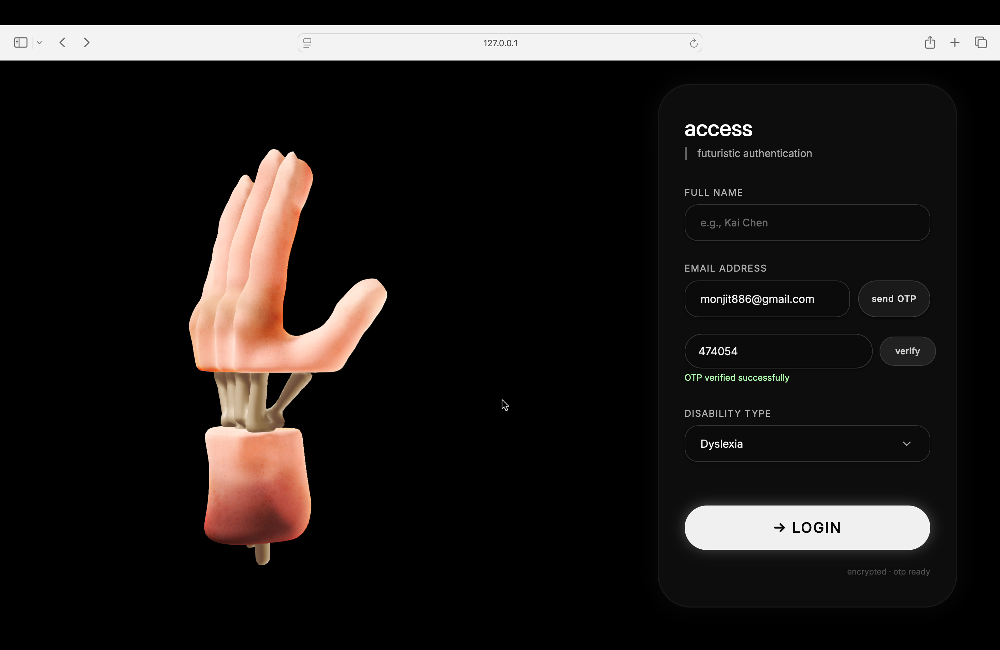
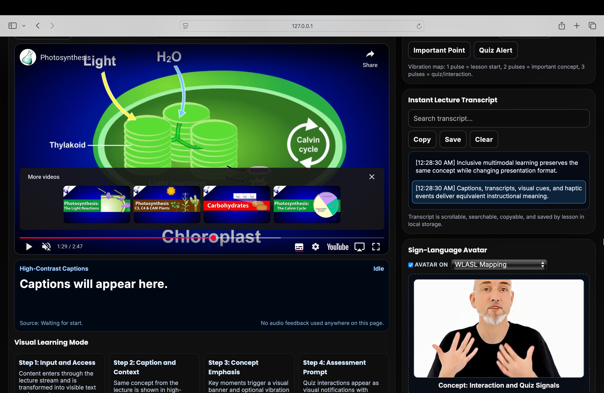
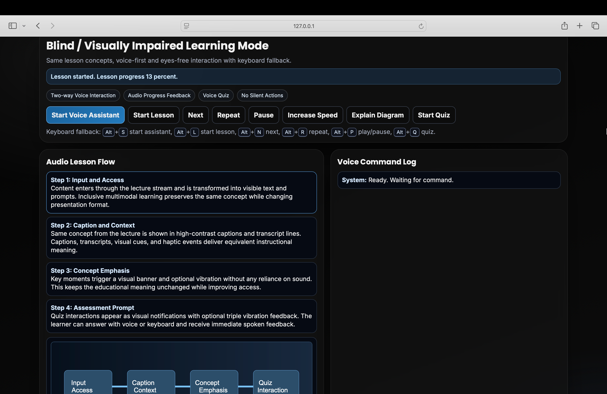
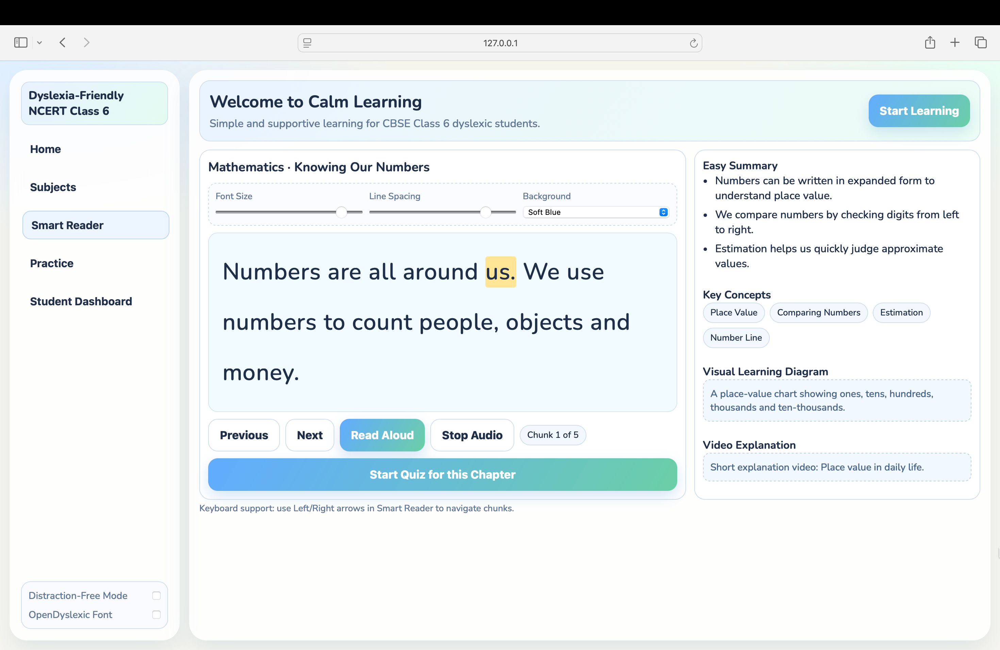
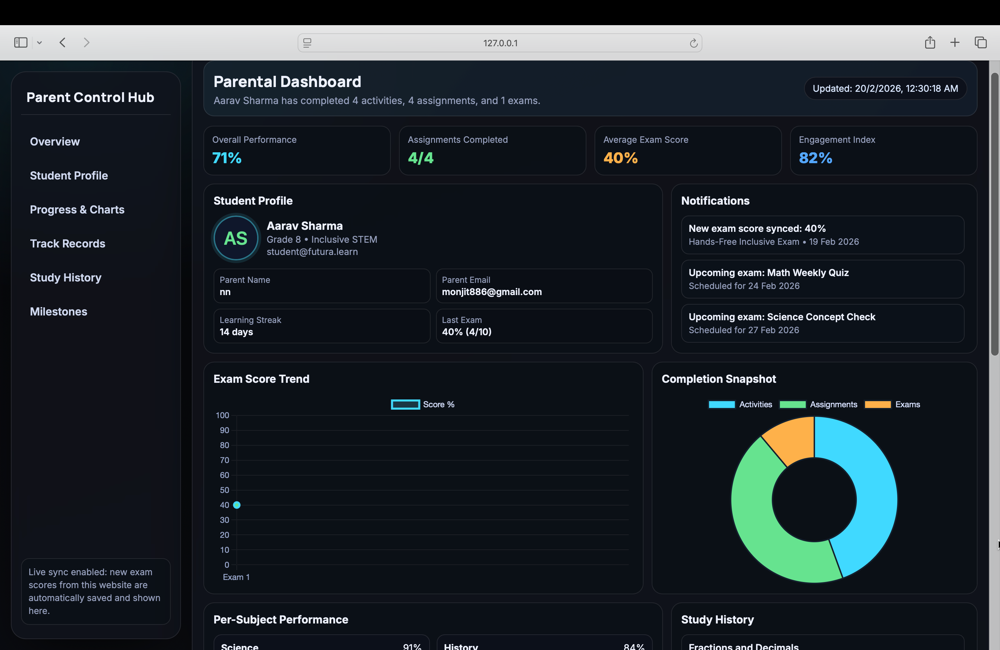
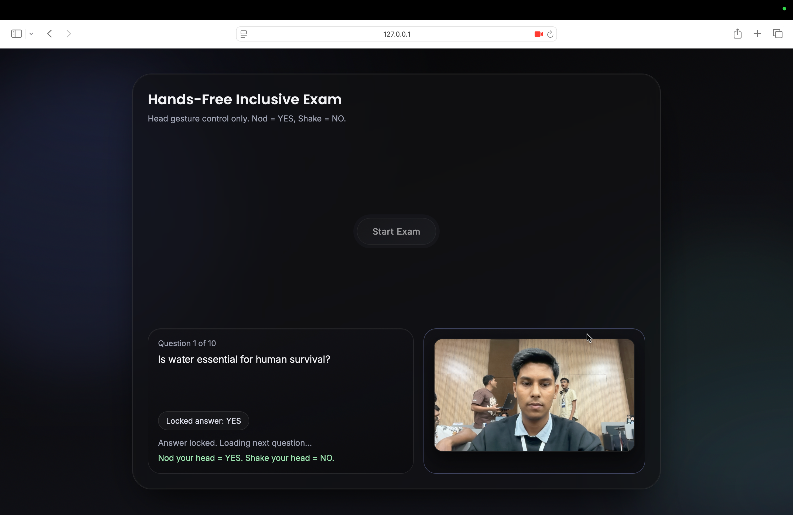

# 🌍 Edu-Able  
### *Inclusive EdTech Learning Platform for Every Mind*  

> **Empowering students with diverse learning needs through accessible, human-centered digital education.**  
> Edu-Able is built to ensure that learners with **dyslexia, blindness, deafness, and other learning differences** can study with confidence, independence, and dignity.

<p align="left">
  
  
  
  
  
</p>

---

## 📸 Platform Screenshots

### 🔐 Login & Authentication Screen
  
*Secure login interface with OTP verification and accessibility mode selection.*

---

### 🧏 Deaf Learning Mode
  
*Accessible landing experience designed for deaf learners with visual-first navigation.*

---

### 🦯 Blind Learning Mode
  
*Screen-reader friendly layout with audio guidance and simplified interaction.*

---

### 🧠 Dyslexia Learning Mode
  
*Readable typography, chunked reading, focus controls, and dyslexia-friendly UI.*

---

### 👨‍👩‍👧 Parent Dashboard
  
*Performance monitoring panel with progress tracking and learning insights.*

---

### ♿ Physical Handicap Support (Coming Soon)
  
*Assistive interaction tools and adaptive controls for physically challenged students.*

---

### ⚡ ADHD Focus Mode (Coming Soon)
  
*Distraction-reduced interface with guided learning and focus support tools.*

---

### 📝 Accessible Exam System
  
*Hands-free accessible exam workflow with score tracking and performance analytics.*


---

## 🚀 About the Project

**Edu-Able** is an inclusive learning platform designed to make digital education genuinely accessible for students who are often underserved by conventional learning apps.

### Why this matters
Most platforms assume one learning style. Edu-Able challenges that by delivering multiple adaptive interfaces so students can learn in ways that match their cognitive and sensory needs.

### Problem we solve
- Learning tools that are visually dense and inaccessible
- Limited support for different disabilities in one platform
- Weak parent visibility into actual student progress

### Who it helps
- 🧒 Students with dyslexia, visual impairment, hearing impairment, and mixed learning needs  
- 👩‍🏫 Teachers who need inclusive digital resources  
- 👨‍👩‍👧 Parents monitoring progress and outcomes  

---

## ✨ Core Features

### ♿ Accessibility Features
- Dyslexia-friendly reading interface (font, spacing, contrast controls)
- Blind learning mode with voice-first interaction
- Deaf learning mode with live caption workflows
- Distraction-reduced UI patterns and large tap/click targets
- Keyboard-friendly interaction and accessible layout structure

### 📚 Learning Features
- Subject-wise study flow and chapter navigation
- Smart chapter reader with chunked text display
- Summary blocks, concept highlights, and visual support sections
- Mode-specific UI tuned for learner comfort and clarity

### 📝 Exam System
- Interactive exam experience with scoring
- Accessible exam page flow and completion state
- Exam result persistence for dashboard integration

### 📊 Dashboard Features
- Parent dashboard with performance visibility
- Exam history and progress indicators
- Learning engagement and completion tracking snapshots

---

## 🧰 Tech Stack

| Layer | Technologies |
|---|---|
| **Frontend** | HTML5, CSS3, Vanilla JavaScript |
| **Backend** | Node.js, Express |
| **Runtime** | Node.js (local server) |
| **Languages** | JavaScript, HTML, CSS |
| **Other Tools** | Nodemailer, Chart.js, MediaPipe, OpenCV.js, dotenv |

---

## 🗂️ Folder Structure

```bash
Edu-Able/
├── assets/
├── components/
│   └── exam/
├── pages/
│   └── exam/
├── dyslexia/
│   ├── app.js
│   └── data.js
├── blind-learning.html
├── deaf-learning.html
├── dyslexia-platform.html
├── parent-dashboard.html
├── index.html
├── server.js
├── package.json
├── .env.example
└── README.md
```

---

## ⚙️ Installation Guide

### 1) Clone the repository
```bash
git clone https://github.com/your-username/edu-able.git
cd edu-able
```

### 2) Install dependencies
```bash
npm install
```

### 3) Configure environment variables
```bash
cp .env.example .env
```
Update `.env` with valid values.

### 4) Start the server
```bash
node server.js
```

### 5) Open in browser
```bash
http://localhost:3000
```

---

## 🔐 Environment Variables

Create a local `.env` file from `.env.example`:

```bash
cp .env.example .env
```

Typical variables:
- `PORT`
- `SMTP_USER`
- `SMTP_PASS`
- `SMTP_FROM`
- `SENDGRID_API_KEY` (optional)
- `OTP_SECRET`
- `OPENAI_API_KEY` (if using Whisper endpoint)

✅ Keep secrets in `.env` only  
❌ Never commit `.env` to GitHub

---

## 🧭 How to Use

1. Open the homepage (`/`)
2. Complete OTP verification
3. Choose a learning mode (Dyslexia / Blind / Deaf / Exam / Parent)
4. Start learning chapter content in accessible flow
5. Attempt the exam
6. Review progress and outcomes in dashboards

---

## 💡 Accessibility Impact

### 🧠 Dyslexia Support
- Reduced visual clutter
- Better spacing and readable typography controls
- Chunked reading to reduce cognitive overload
- Calming color themes and focus-friendly UI

### 👁️ Blind Mode
- Voice-first guidance
- Speech synthesis support for content delivery
- Interaction model optimized for non-visual navigation

### 🧏 Deaf Mode
- Caption-centric learning workflow
- Transcript-style interaction support
- Visual-first instructional structure

Edu-Able is not just a product feature set, it is an accessibility commitment.

---

## 🛣️ Future Roadmap

- 🤖 AI-powered personalized tutor
- 🗣️ More robust speech understanding and feedback loops
- 📱 Mobile-first companion app (Android/iOS)
- 🧑‍🏫 Teacher classroom controls and assignment publishing
- ☁️ Cloud sync for cross-device progress
- 🌐 Multi-language and regional curriculum support

---

## 🤝 Contributing

Contributions are welcome and appreciated.

1. Fork the repository  
2. Create a feature branch  
   ```bash
   git checkout -b feature/your-feature-name
   ```
3. Commit your changes  
   ```bash
   git commit -m "feat: add your feature"
   ```
4. Push and open a Pull Request  

Please keep contributions accessibility-focused and user-impact driven.

---

## 📄 License

This project is licensed under the **MIT License**.  
See the `LICENSE` file for details.

---

<p align="center">
  <strong>Edu-Able</strong> • Inclusive by design • Built for real learners
</p>
